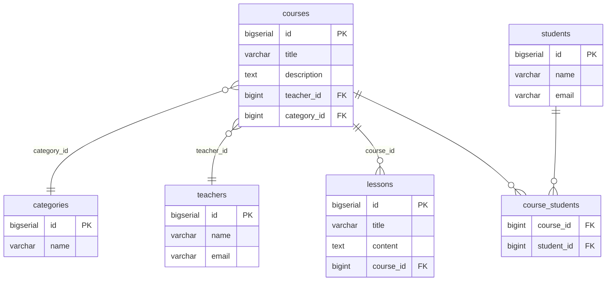

# LMS Platform 🚀

[](https://spring.io/projects/spring-boot)
[](https://www.oracle.com/java/)
[](https://checkstyle.org/)
[](https://www.postgresql.org/)
[](https://reactjs.org/)
[](https://www.docker.com/)
[](https://render.com/)

Комплексная платформа управления обучением (Learning Management System), реализующая все требования лабораторных работ по Spring Boot, JPA, Spring MVC, тестированию, concurrency и DevOps.

---

## 🛠 Стек технологий

*   **Backend:** Java 21, Spring Boot 3.4.2, Spring Data JPA, Hibernate
*   **Frontend:** React 18, React Router v7, Tailwind CSS, Lucide React, Axios
*   **Database:** PostgreSQL 15
*   **Containerization:** Docker, Docker Compose
*   **Quality:** Google Checkstyle, JUnit 5, Mockito
*   **API Documentation:** SpringDoc OpenAPI 3 (Swagger)
*   **Monitoring:** Spring Boot Actuator, Logback
*   **CI/CD:** GitHub Actions
*   **Hosting:** Render (PaaS)

---

## � Требования лабораторных работ (статус реализации)

### ✅ Лабораторная работа 1: Basic REST Service
*   [x] Создание Spring Boot приложения
*   [x] Реализация REST API для сущности `Course` (ключевая сущность предметной области)
*   [x] GET endpoint с `@RequestParam` (фильтрация по названию)
*   [x] GET endpoint с `@PathVariable` (получение по ID)
*   [x] Архитектура слоёв: Controller → Service → Repository
*   [x] Реализация DTO и mapper между Entity и API-ответом
*   [x] Настройка Checkstyle (Google Style) и приведение кода к стандарту

### ✅ Лабораторная работа 2: JPA & Hibernate
*   [x] Подключение реляционной БД (PostgreSQL)
*   [x] Модель данных из 5 сущностей: `Course`, `Teacher`, `Student`, `Lesson`, `Category`
*   [x] Связь OneToMany: Teacher → Course, Course → Lesson
*   [x] Связь ManyToMany: Course ↔ Student
*   [x] Связь ManyToOne: Course → Category
*   [x] Полный CRUD для всех сущностей
*   [x] Настройка CascadeType (PERSIST, MERGE для ассоциаций)
*   [x] Настройка FetchType (LAZY для коллекций)
*   [x] Решение проблемы N+1 через `@EntityGraph` в `CourseRepository`
*   [x] Метод сохранения нескольких связанных сущностей в транзакции
*   [x] Демонстрация частичного сохранения без `@Transactional` и полного отката с `@Transactional`
*   [x] ER-диаграмма с PK/FK и связями (см. ниже)

### ✅ Лабораторная работа 3: Advanced Queries & Caching
*   [x] Сложный GET-запрос с фильтрацией по вложенной сущности через `@Query` (JPQL)
*   [x] Аналогичный запрос через native query
*   [x] Пагинация через `Pageable` во всех фильтр-методах
*   [x] In-memory индекс на основе `HashMap<K, V>` для ранее запрошенных данных
*   [x] Составной ключ из параметров запроса
*   [x] Корректная реализация `equals()` и `hashCode()` для ключа индекса
*   [x] Инвалидация индекса при изменении данных (CRUD операции)

### ✅ Лабораторная работа 4: Error Handling & Logging
*   [x] Глобальная обработка ошибок через `@ControllerAdvice`
*   [x] Валидация входных данных через `@Valid` (JSR-380)
*   [x] Единый формат ошибки для всех endpoint (`ErrorResponse`)
*   [x] Логирование через Logback:
    *   Уровни логирования (DEBUG, INFO, WARN, ERROR)
    *   Ротация логов по размеру и времени
*   [x] Аспект (AOP) для логирования времени выполнения сервисных методов (`LoggingAspect`)
*   [x] Swagger/OpenAPI с описанием всех endpoint и DTO

### ✅ Лабораторная работа 5: Bulk Operations & Testing
*   [x] Bulk-операция POST со списком уроков (`POST /api/lessons/bulk`)
*   [x] Использование Stream API и Optional в сервисном слое
*   [x] Транзакционность bulk-операции
*   [x] Демонстрация работы с/без `@Transactional` через тестовые endpoint
*   [x] Unit-тесты для сервисов с использованием Mockito

### ✅ Лабораторная работа 6: Async & Concurrency
*   [x] Асинхронная бизнес-операция через `@Async` / `CompletableFuture`
*   [x] Endpoint возвращающий ID задачи (`POST /api/tasks/start`)
*   [x] Endpoint для проверки статуса выполнения (`GET /api/tasks/{id}/status`)
*   [x] Endpoint для получения результата (`GET /api/tasks/{id}/result`)
*   [x] Потокобезопасный счётчик с использованием `AtomicLong`
*   [x] Демонстрация race condition через `ExecutorService` (50+ потоков)
*   [x] Решение race condition через `synchronized` блок
*   [x] Нагрузочное тестирование JMeter с планом тестирования

### ✅ Лабораторная работа 7: SPA Client
*   [x] SPA-клиент на React
*   [x] Клиент работает с API (получение, создание, обновление, удаление данных)
*   [x] Отображение связей OneToMany (курс → уроки, преподаватель → курсы)
*   [x] Отображение связей ManyToMany (курс ↔ студенты)
*   [x] CRUD операции для всех сущностей
*   [x] Фильтрация по категориям, преподавателям, студентам
*   [x] Пагинация на стороне клиента

### ✅ Лабораторная работа 8: DevOps
*   [x] Dockerfile для приложения (multi-stage build: frontend + backend)
*   [x] Docker Compose (приложение + PostgreSQL)
*   [x] Использование переменных окружения
*   [x] Размещение на бесплатном хостинге PaaS (Render): https://lms-platform-app.onrender.com
*   [x] CI/CD в GitHub:
    *   Сборка (Maven)
    *   Тесты (JUnit 5, PostgreSQL service)
    *   Сборка Docker образа
    *   Развертывание (placeholder для Render deploy hook)
    *   Healthcheck

---

## 🗺 ER-диаграмма



---

## 💻 Быстрый старт

### Требования
*   Java 21
*   Node.js 20+ (для сборки фронтенда)
*   Docker & Docker Compose (для локального PostgreSQL)

### Локальный запуск с Docker Compose

```bash
docker-compose up -d
./mvnw spring-boot:run
```

### Локальный запуск без Docker (PostgreSQL должен быть установлен)

```bash
export DB_URL=jdbc:postgresql://localhost:5432/lmsdb
export DB_USERNAME=lmsuser
export DB_PASSWORD=your_password
./mvnw spring-boot:run
```

### Сборка Docker образа

```bash
docker build -t lms-platform .
docker run -p 8080:8080 \
  -e DB_URL=jdbc:postgresql://host.docker.internal:5432/lmsdb \
  -e DB_USERNAME=lmsuser \
  -e DB_PASSWORD=your_password \
  lms-platform
```

---

## 🧪 API Documentation

### Swagger UI
После запуска приложения доступен по адресу:
```
http://localhost:8080/swagger-ui.html
```

### REST API Endpoints

#### Курсы (Courses)
*   `GET /api/courses` — Список всех курсов (оптимизировано через EntityGraph)
*   `GET /api/courses/{id}` — Детали курса
*   `GET /api/courses/{courseId}/lessons` — Уроки курса
*   `GET /api/courses/search?title={title}` — Поиск по названию (@RequestParam)
*   `POST /api/courses` — Создание курса
*   `POST /api/courses/{courseId}/lessons` — Добавление урока на курс
*   `POST /api/courses/{courseId}/students/{studentId}` — Запись студента на курс
*   `PUT /api/courses/{id}` — Полное обновление
*   `PATCH /api/courses/{id}` — Частичное обновление
*   `DELETE /api/courses/{id}` — Удаление
*   `GET /api/courses/filter` — Фильтрация по department, category, price (JPQL + пагинация)
*   `GET /api/courses/filter/native` — То же через native query + пагинация

#### Уроки (Lessons)
*   `GET /api/lessons` — Список всех уроков
*   `GET /api/lessons/{id}` — Детали урока
*   `POST /api/lessons` — Создание урока
*   `POST /api/lessons/bulk` — Bulk-создание списка уроков (с транзакцией)
*   `PUT /api/lessons/{id}` — Обновление урока
*   `DELETE /api/lessons/{id}` — Удаление урока
*   `GET /api/lessons/filter` — Фильтрация по courseId, courseTitle, title (JPQL + пагинация)
*   `GET /api/lessons/filter/native` — То же через native query + пагинация

#### Учителя (Teachers)
*   `GET /api/teachers` — Список учителей
*   `GET /api/teachers/{id}` — Детали учителя
*   `POST /api/teachers` — Создание учителя
*   `PUT /api/teachers/{id}` — Обновление учителя
*   `DELETE /api/teachers/{id}` — Удаление учителя
*   `GET /api/teachers/filter` — Фильтрация по name, department, courseCategory (JPQL + пагинация)
*   `GET /api/teachers/filter/native` — То же через native query + пагинация

#### Студенты (Students)
*   `GET /api/students` — Список студентов
*   `GET /api/students/{id}` — Детали студента
*   `POST /api/students` — Создание студента
*   `PUT /api/students/{id}` — Обновление студента
*   `DELETE /api/students/{id}` — Удаление студента
*   `GET /api/students/filter` — Фильтрация по name, email, courseTitle (JPQL + пагинация)
*   `GET /api/students/filter/native` — То же через native query + пагинация

#### Категории (Categories)
*   `GET /api/categories` — Список категорий
*   `GET /api/categories/{id}` — Детали категории
*   `POST /api/categories` — Создание категории
*   `PUT /api/categories/{id}` — Обновление категории
*   `DELETE /api/categories/{id}` — Удаление категории
*   `GET /api/categories/filter` — Фильтрация по name, teacherDepartment (JPQL + пагинация)
*   `GET /api/categories/filter/native` — То же через native query + пагинация

#### Тестовые endpoint (демонстрация транзакций)
*   `POST /api/test/no-transaction` — Попытка сохранения без `@Transactional` (частичное сохранение)
*   `POST /api/test/with-transaction` — Сохранение с `@Transactional` (полный откат)

#### Асинхронные задачи
*   `POST /api/tasks/start` — Запуск асинхронной задачи (возвращает taskId)
*   `GET /api/tasks/{id}/status` — Проверка статуса выполнения задачи
*   `GET /api/tasks/{id}/result` — Получение результата задачи
*   `GET /api/tasks/{id}` — Полная информация о задаче

#### Конкурентные операции (демонстрация race condition)
*   `POST /api/demo/race-condition` — Запуск 100 потоков для демонстрации race condition
*   `POST /api/demo/race-condition-fixed` — То же с исправлением через synchronized

---

## 🏗 Архитектура проекта

### Пакетная структура
```
src/main/java/me/learning/lmsplatform/
├── config/           # Конфигурация (AOP, Swagger, инициализация данных)
├── controller/       # REST контроллеры
├── dto/             # Объекты передачи данных
├── exception/       # Глобальная обработка ошибок
├── mapper/          # Entity <-> DTO преобразователи
├── model/           # JPA сущности
├── repository/      # Spring Data JPA репозитории
└── service/         # Бизнес-логика
```

### Ключевые компоненты

**Data Caching (`CourseService`)**
*   In-memory индекс на `HashMap<QueryKey, List<CourseDto>>`
*   Ключ включает параметры фильтрации и пагинации
*   Инвалидация при CRUD операциях

**Error Handling (`GlobalExceptionHandler`)**
*   Единый формат ответа об ошибках
*   Обработка валидационных ошибок, ResourceNotFound, и т.д.

**AOP Logging (`LoggingAspect`)**
*   Логирование времени выполнения сервисных методов
*   Логирование параметров и результатов

**Async Tasks (`AsyncTaskService`)**
*   Выполнение тяжёлых операций в отдельных потоках
*   Хранение статуса и результата в памяти

---

## 🧪 Тестирование

### Unit тесты
```bash
./mvnw test
```

### Запуск конкретного тестового класса
```bash
./mvnw test -Dtest=CourseServiceTest
```

### JMeter нагрузочное тестирование
```bash
export JVM_ARGS="-Xms512m -Xmx1024m"
/tmp/apache-jmeter-5.6.3/bin/jmeter -t jmeter/lms-platform-load-test.jmx
```

---

## 🚀 Deployment

### Render (PaaS)
Приложение развёрнуто на бесплатном тарифе Render:
```
https://lms-platform-app.onrender.com
```

**Healthcheck:**
```
https://lms-platform-app.onrender.com/actuator/health
```

### Переменные окружения (Render)
*   `DB_URL` — URL PostgreSQL базы
*   `DB_USERNAME` — Имя пользователя БД
*   `DB_PASSWORD` — Пароль БД
*   `SPRING_PROFILE` — Профиль (prod/local)

### CI/CD (GitHub Actions)
Workflow `.github/workflows/ci-cd.yml`:
*   Сборка Maven
*   Запуск тестов с PostgreSQL service
*   Сборка Docker образа
*   Пуш в Docker Hub
*   Deploy placeholder (для интеграции с Render deploy hook)

---

## 📊 Мониторинг

### Actuator Endpoints
*   `/actuator/health` — Здоровье приложения
*   `/actuator/metrics` — Метрики

### Логи
Логи пишутся в файл с ротацией по размеру и времени (logback-spring.xml)

---

## 📝 Frontend

### Структура
```
frontend/src/
├── api/          # API клиенты (axios)
├── components/   # Переиспользуемые UI компоненты
├── pages/        # Страницы приложения
└── App.jsx       # Роутинг
```

### Страницы
*   `/courses` — Курсы с фильтрацией, сортировкой, пагинацией
*   `/lessons` — Уроки с фильтрацией по курсу
*   `/teachers` — Преподаватели
*   `/students` — Студенты с отображением курсов
*   `/categories` — Категории с переходом на курсы

---

## 🎯 Ключевые демонстрации

### Решение N+1 проблемы
Использование `@EntityGraph` в `CourseRepository` для загрузки связанных сущностей (teacher, category) в одном запросе.

### Транзакции
Endpoint `/api/test/no-transaction` и `/api/test/with-transaction` демонстрируют разницу в поведении при ошибках.

### In-memory индекс
`CourseService` кеширует результаты фильтрации с составным ключом из параметров запроса.

### Асинхронность
`AsyncTaskService` выполняет долгие операции в фоне, предоставляя ID задачи для опроса статуса.

### Race condition
Демонстрация через 100 потоков, инкрементирующих счётчик. Без синхронизации результат некорректен, с `synchronized` — корректен.

---

## 📄 Лицензия
Educational project for university coursework.
