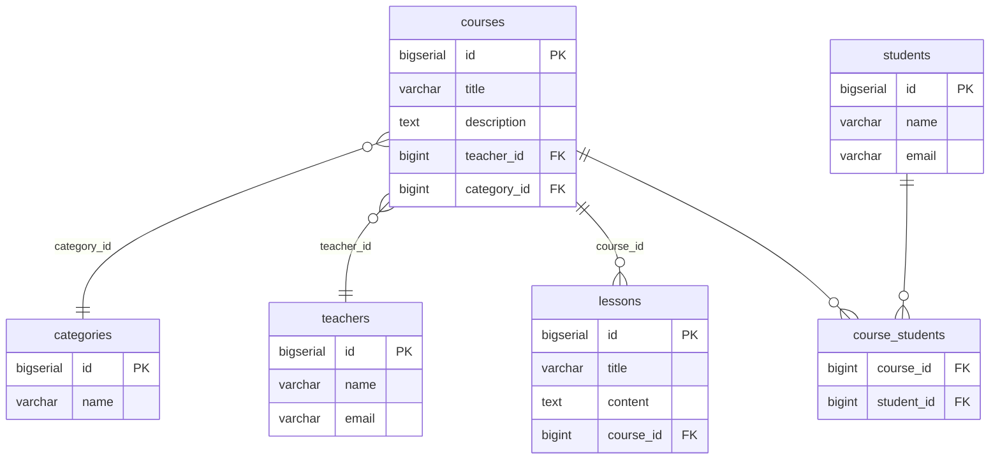

# LMS Platform 🚀

[](https://spring.io/projects/spring-boot)
[](https://www.oracle.com/java/)
[](https://checkstyle.org/)
[](https://www.postgresql.org/)

Профессиональная платформа управления обучением (Learning Management System), разрабатываемая как комплексный проект по изучению Spring Boot и современной веб-разработки.

---

## 🛠 Стек технологий

*   **Core:** Java 21, Spring Boot 3
*   **Data:** Spring Data JPA, Hibernate, PostgreSQL
*   **Containerization:** Docker, Docker Compose
*   **Quality:** Google Checkstyle
*   **Tools:** Maven, Postman

---

## 📈 Дорожная карта и прогресс

### ✅ Этап 1: Basic REST Service (Завершено)
*   [x] Инициализация Spring Boot проекта.
*   [x] Реализация REST API для сущности `Course`.
*   [x] Эндпоинты с использованием `@RequestParam` и `@PathVariable`.
*   [x] Построение архитектуры: **Controller → Service → Repository**.
*   [x] Использование **DTO** и паттерна Mapper.
*   [x] Настройка **Checkstyle** (Google Style) для контроля качества кода.

### ✅ Этап 2: JPA & Hibernate (Завершено)
*   [x] Реализация модели данных из 5 сущностей: `Course`, `Teacher`, `Student`, `Lesson`, `Category`.
*   [x] Настройка связей:
    *   `OneToMany` (Teacher ↔ Course, Course ↔ Lesson)
    *   `ManyToMany` (Course ↔ Student)
    *   `ManyToOne` (Course ↔ Category)
*   [x] Реализация полного цикла CRUD (GET, POST, PUT, PATCH, DELETE).
*   [x] Настройка `CascadeType` и `FetchType`.
*   [x] Решение проблемы N+1 через `@EntityGraph` в `CourseRepository`.
*   [x] Демонстрация работы транзакций (`@Transactional` vs Non-transactional save).
*   [x] Автоматическая инициализация данных при запуске (`DataInitializer`).

### ⏳ Будущие этапы
*   **Data Caching:** Пагинация, JPQL/Native запросы и собственный in-memory индекс.
*   **Error Handling:** Глобальный обработчик ошибок и логирование через AOP.
*   **Testing:** Unit-тесты с использованием Mockito и Stream API.
*   **Concurrency:** Асинхронные задачи и нагрузочное тестирование в JMeter.
*   **DevOps:** GitHub CI/CD.

---

## 🗺 ER-диаграмма



---

## 💻 Быстрый старт

### Требования
*   Java 21
*   Docker & Docker Compose (для PostgreSQL)

### Запуск приложения
Приложение использует **Spring Boot Docker Compose**, поэтому база данных поднимется автоматически.
```bash
export DB_PASSWORD=your_password
./mvnw spring-boot:run
```

---

## 🧪 Тестирование API

### Курсы (Courses API)
*   `GET /api/courses` — Список всех курсов (оптимизировано через EntityGraph).
*   `GET /api/courses/{id}` — Детали курса.
*   `POST /api/courses` — Создание нового курса.
*   `PUT /api/courses/{id}` — Полное обновление.
*   `PATCH /api/courses/{id}` — Частичное обновление.
*   `DELETE /api/courses/{id}` — Удаление.

### Демонстрация транзакций
*   `POST /api/test/no-transaction` — Попытка сохранения без `@Transactional` (демонстрирует частичное сохранение при ошибке).
*   `POST /api/test/with-transaction` — Сохранение с `@Transactional` (демонстрирует полный откат при ошибке).
*   `GET /api/categories` — Просмотр списка категорий для проверки результатов тестов.

---

## 🏗 Архитектура проекта
*   `model` — JPA сущности.
*   `repository` — Интерфейсы Spring Data JPA.
*   `service` — Бизнес-логика.
*   `controller` — REST эндпоинты.
*   `dto` — Объекты передачи данных.
*   `mapper` — Преобразование Entity <-> DTO.
